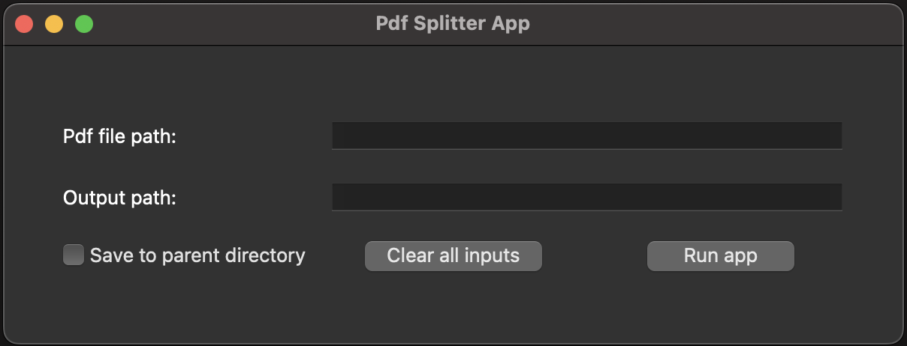
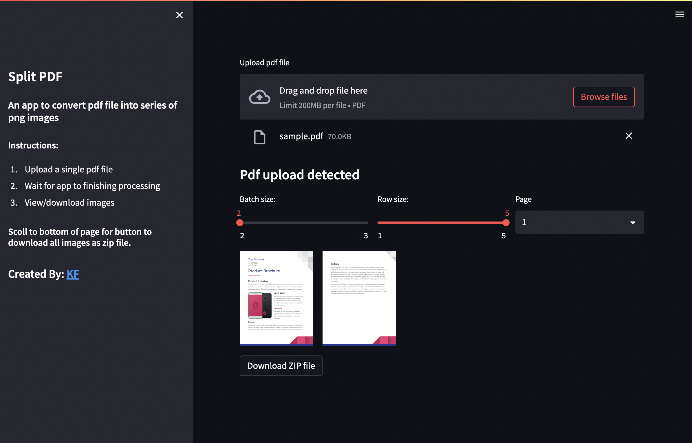

## SplitPdf: Convert pdf file into series of images

Repo contains the following:

- __DesktopApp__: Desktop application
- __WebApp__: Hosted web application
  - Free tier of host server is limited to 512MB RAM
  - 

### App Screenshots

#### Desktop Version

  

#### WebApp Version

