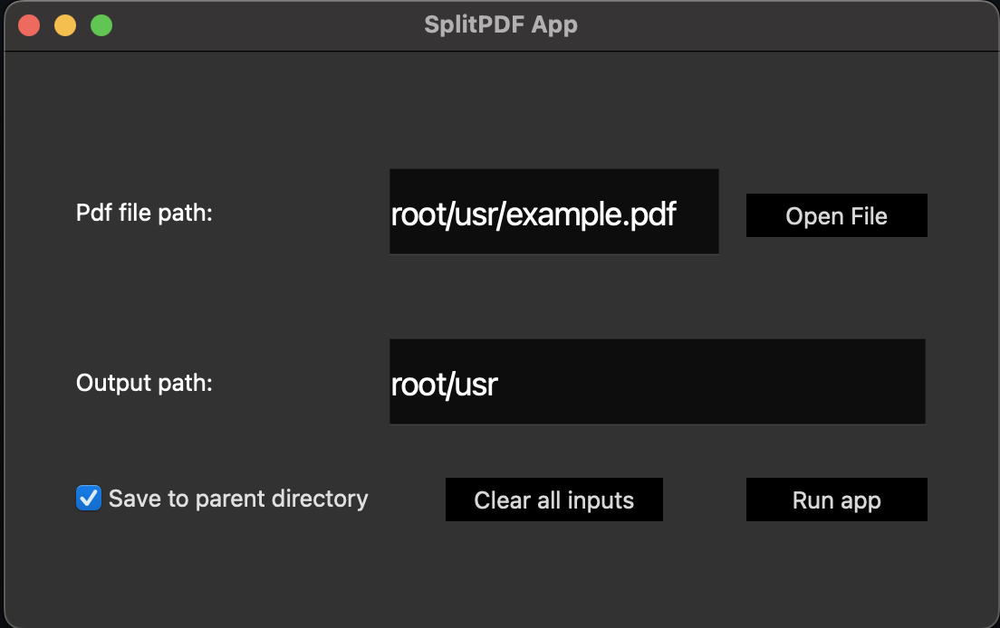

## SplitPdf: Convert pdf file into series of images

Repo contains the following:

- __DesktopApp__: Desktop application
- __ScriptVer__: Single executable (CLI app)
- __WebApp__: Hosted web application
  - Free tier of host server is limited to 512MB RAM
  - 

### App Screenshots

#### Desktop Version

  

#### WebApp Version

> ***Note:*** The webapp version is hosted on a server limited to 512MB RAM. It will crash if > 512MB RAM used.
> 
> __Host on server with > 512 MB RAM if working with large pdf files.__

